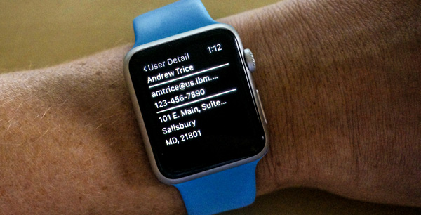
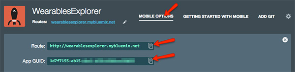

#Contacts
An ultra-simplistic contact list application that demonstrates MobileFirst on Bluemix integration, with shared client-side code between an iPhone and Apple Watch project.  Ths sample also demonstrates consumption of data on IBM Cloudant through an API on Node.js created using the [LoopBack][http://loopback.io] framework for Node.js   



*Note: This project is intended to show code reuse across projects, however, it is strongly encouraged that a real-world production application on the watch actually reads from a local on-device data store/cache instead of making network requests.  Also, I didn't put any error checking in the ui or network request logic.*

---

### Bluemix Services Used

1. [Mobile Client Access][ama_url] - Capture analytics and logs from mobile apps running on devices

---

### Setting Up The Bluemix Backend


1. Create a Bluemix Account

    [Sign up][bluemix_signup_url] for Bluemix, or sign in using an existing account.
	
2. From the Bluemix Dashboard, click on the "Create App" link, then select the "Mobile" template and walk through the process of creating your app infrastructure.  *Remember the app namel you are going to need it later.*

3. Download and install the [Cloud-foundry CLI][cloud_foundry_url] tool.  This will be used to deploy your Node.js back end.

4. Clone the app to your local environment from your terminal using the following command

  ```
  git clone https://github.com/triceam/MobileFirst-Wearables/tree/master/Contacts.git
  ```

5. Open the file server/Contacts-Database/server/datasources.json and configure your credentials for IBM Cloudant.

6. Back in the command line termianl, cd into this newly created directory, then go into the /server directory.

7. Connect to Bluemix in the command line tool and follow the prompts to log in.

  ```
  $ cf api https://api.ng.bluemix.net
  $ cf login
  ```

8. Push it to Bluemix. This will automatically deploy the back end app and start the Node.js instance.  Replace "AppName" with the name of your app on Bluemix.

  ```
  $ cf push AppName
  ```
  
9. Voila! You now have your very own API instance up and running on Bluemix.  Next we need to configure the Mobile Client application.  You can test your API deployment at https://yourapp.mybluemix.net/explorer.  You can view my live API deployment as a referene [here](http://wearablesexplorer.mybluemix.net/explorer/).

---

### Setting Up The Mobile App

The native iOS application requires **Xcode 6.4** running on a Mac to compile and deploy on either the iOS Simulator or on a development device.  Xcode 6.4 is required to target Apple WatchOS 1.0.

1. If you do not already have it, download and install [CocoaPods][cocoapods_url].

2. In a terminal window, cd into the /client directory (from your local project directory).

3. Run the *pod install* command to setup the Xcode project and download all dependencies.

  ```
  $ pod install
  ```

4. This will create an Xcode Workspace file.  Open the **WearablesExplorer.xcworkspace** file in Xcode.

5. Open the "**BluemixConnector.swift**" file.  Update the connection to Bluemix on line 27 to include your app's route and GUID.   

  ```
  IMFClient.sharedInstance().initializeWithBackendRoute("http://yourapp.mybluemix.net", backendGUID: "Your GUID goes here");
  ```
  You can access the route and app GUID under "Mobile Options" on the app dashboard.
  

6. Open the "**DataManager.swift**" file.  On lines 19 and 21 edit the listPath and deailPath strings to use your app's route prefix.  These are the url endpoints for the service API requests.

8. Now you are all set!  Launch the app either on a device or in the iOS Simulator using Xcode.  You should initially see a list of contacts in either the phone or watch interface, and you can tap on a name to access additional details for that contact.  
 
   Once your app is running, you should see the message "You have connected to Bluemix successfully" in the Xcode console.  If you see error messages instead, please double check your bundle ID, app route, and app UID in both the Mobile Client Access service on Bluemix and in the Xcode project. These values are case sensitive and must be identical. 

---

### Troubleshooting

To troubleshoot your the server side of your Bluemix app the main useful source of information is the logs. To see them, run:

  ```
  $ cf logs <application-name> --recent
  ```
  
  
[bluemix_signup_url]: https://ibm.biz/IBM-Bluemix
[bluemix_dashboard_url]: https://ibm.biz/Bluemix-Dashboard
[cloud_foundry_url]: https://github.com/cloudfoundry/cli
[download_node_url]: https://nodejs.org/download/
[cocoapods_url]: https://cocoapods.org/
[ama_url]: https://ibm.biz/Bluemix-AdvancedMobileAccess
